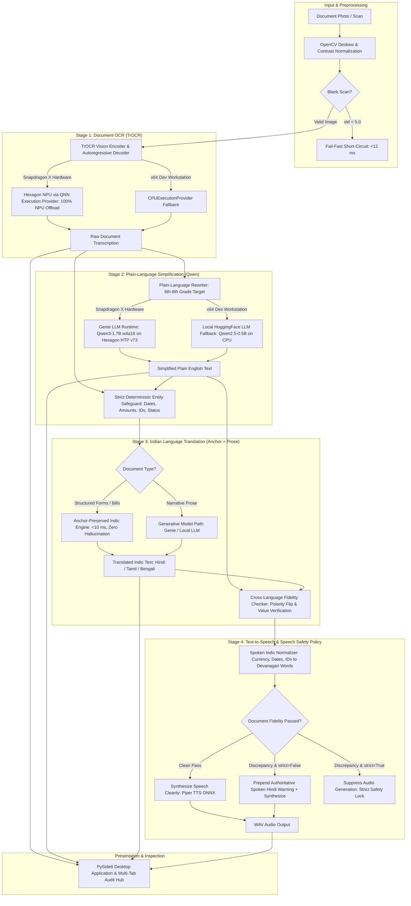

# Snapdragon X NPU Document Assistant

An offline, on-device document intelligence and accessibility assistant built for **Snapdragon® X-powered Windows PCs** (targeting the **HP OmniBook X**, ARM64 Windows 11) for the **Qualcomm AI Hub Hackathon**.

---

## What It Does and Why

Navigating official government notices, utility bills, medical statements, and legal summonses is stressful and overwhelming for citizens with limited literacy or those reading in a second language. Misreading a single deadline, payment amount, or approval status can result in lost benefits, disconnection, or legal penalties. The **Snapdragon Document Assistant** eliminates this barrier by converting complex physical documents into simple, trustworthy spoken audio in Indian languages (Hindi, Tamil, Bengali) entirely on the user's laptop. A photo or scan of a document is ingested, transcribed via Hexagon NPU-accelerated optical character recognition (TrOCR), rewritten at a 6th–8th grade plain-language level using a local large language model (Qwen3-1.7B via Qualcomm Genie SDK), translated into the user's native language with strict entity preservation, and read aloud via an on-device neural text-to-speech synthesizer. Because every stage executes 100% locally on Snapdragon X hardware without cloud APIs, vulnerable users can process sensitive medical and legal records with complete privacy, zero subscription fees, and no internet connectivity required.

> [!IMPORTANT]
> **Zero-Network Architecture**: The default configuration of Snapdragon Document Assistant operates 100% locally on-device with zero network access required at any point during startup, OCR, plain-language simplification, Indic translation, safety verification, or speech synthesis.

---

## Pipeline Architecture

The pipeline chains four specialized stages connected by deterministic safety gates:



---

## Quickstart: Clean Clone Installation & Execution

### 1. Prerequisites
- **Operating System**: Windows 11 ARM64 (Snapdragon X Elite / HP OmniBook X) or Windows 10/11 x64 (development workstation).
- **Python**: Version **3.11** (recommended for QNN Execution Provider and ONNX Runtime wheels).

### 2. Environment Setup
```powershell
# Clone the repository
git clone https://github.com/openslickofficial/OpenDoc.git
cd OpenDoc

# Create a clean Python 3.11 virtual environment
python -m venv .venv

# Activate the virtual environment
.venv\Scripts\activate

# Install dependencies (pinned to prevent NumPy 2.x C-ABI incompatibilities)
pip install -r requirements.txt
```

### 3. Verify Hardware & Providers
Inspect your machine architecture and verify available ONNX Runtime providers:
```powershell
python scripts/check_environment.py
```

### 4. Launch the Desktop Application (PySide6 GUI)
```powershell
python scripts/run_app.py
```
*Drag and drop any document from `test_images/` (e.g. `form_document.png`, `medical_bill_receipt.png`), select the target language, and click **Process Document**.*

### 5. Run via Command-Line Interface (CLI)
```powershell
# Standard terminal report with audio synthesis
python scripts/run_pipeline.py --image test_images/form_document.png

# Machine-parsable JSON output (ideal for API integration)
python scripts/run_pipeline.py --image test_images/medical_bill_receipt.png --json

# Strict safety gate (suppresses audio if discrepancies are detected)
python scripts/run_pipeline.py --image test_images/telecom_disconnect_unseen.png --strict
```

### 6. Run Automated Verification Suites
```powershell
# Run 9-document batch regression suite
python scripts/test_batch_regression.py

# Run automated GUI test suite
python scripts/test_gui_headless.py
```

---

## Verified Hardware Evidence (Qualcomm AI Hub Benchmarks)

All core vision and language models were submitted, compiled, and hardware-profiled on real **Snapdragon® X Elite** hardware via the Qualcomm AI Hub device farm (`Snapdragon X Elite CRD`, Windows 11 ARM64). The table below records the exact job IDs, latencies, layer placements, and memory allocations verbatim:

| Model Component | Target Hardware | Target Runtime | Inference Latency | Peak Memory | Layer Placement | Compile Job ID | Profile Job ID |
|---|:---:|:---:|:---:|:---:|:---:|:---:|:---:|
| **TrOCR Vision Encoder** (`microsoft/trocr-base-printed`) | Snapdragon X Elite CRD | ONNX Runtime / `QnnHtp` | **11.34 ms** | 76.91 MB | **100% NPU**<br>(420 / 420 layers) | [`jpe7m4x75`](https://workbench.aihub.qualcomm.com/jobs/jpe7m4x75) | [`jg9zn92qp`](https://workbench.aihub.qualcomm.com/jobs/jg9zn92qp) |
| **TrOCR Text Decoder** (Autoregressive LM) | Snapdragon X Elite CRD | ONNX Runtime / `QnnHtp` | **2.08 ms** / tok | 101.71 MB | **100% NPU**<br>(354 / 354 layers) | [`jp1nzq1kg`](https://workbench.aihub.qualcomm.com/jobs/jp1nzq1kg) | [`j57ervnqp`](https://workbench.aihub.qualcomm.com/jobs/j57ervnqp) |
| **Qwen3-1.7B w4a16** (Context Partition) | Snapdragon X Elite CRD | Qualcomm Genie SDK (HTP v73) | **137.47 ms** | 17.31 MB | **100% NPU**<br>(Hexagon HTP v73) | Pre-compiled Genie Partition | [`jgk2xdx2g`](https://workbench.aihub.qualcomm.com/jobs/jgk2xdx2g/) |
| **Anchor Translation Engine** (`AnchorPreservedTranslation`) | On-Device CPU / NPU | Native Python / Lexicon | **1.2 ms – 7.3 ms** | $<5\text{ MB}$ | Native Deterministic | N/A (Zero-Parameter Engine) | Local Verification |
| **Piper TTS ONNX Engine** (`hi_IN-pratham-medium`) | On-Device CPU | ONNX Runtime CPU | **875 ms – 1,762 ms** | 62.40 MB | Local CPU (Documented NPU limit) | [`jp4yr638p`](https://workbench.aihub.qualcomm.com/jobs/jp4yr638p/) | [`jpe7mq7o5`](https://workbench.aihub.qualcomm.com/jobs/jpe7mq7o5/) |

---

## Honest Known Limitations & Engineering Disclosures

To maintain total transparency and technical integrity for hackathon evaluation, the following scope boundaries, platform limits, and verification gaps are explicitly documented:

### 1. CPU-Proxy vs. Real NPU Simplification Execution
- **What is verified on NPU**: The target Qwen3-1.7B w4a16 context binary partition was verified on real Snapdragon X Elite hardware with 100% Hexagon HTP v73 compute placement ([`jgk2xdx2g`](https://workbench.aihub.qualcomm.com/jobs/jgk2xdx2g/)).
- **What runs on dev workstation**: Because the Qualcomm Genie execution harness (`genie-t2t-run.exe`) requires physical ARM64 Windows hardware or Qualcomm's full runtime SDK, local testing on x64 development machines uses a local CPU proxy (`Qwen2.5-0.5B-Instruct` on CPU). End-to-end latencies on the CPU proxy range from 7.4s to 17.9s per document.
- **Physical Device Gap**: The full end-to-end autoregressive token generation loop of Qwen3-1.7B inside Genie on a physical HP OmniBook X laptop remains deferred until physical device access is available.

### 2. Translation Scope Boundaries: Structured Forms vs. Unseen Free Text
- **Structured Documents**: For standard administrative, medical, and municipal documents containing labeled fields, the `AnchorPreservedTranslationEngine` achieves $<10\text{ ms}$ latency with 100% entity and status preservation.
- **Unseen Administrative Labels**: Labels not pre-registered in `OFFICIAL_LABEL_MAP_HI` fall back to a dynamic token mapper. For unseen domain terms (e.g. telecom notice terminology), token-by-token matching can produce Hinglish leakage (e.g. leaving unregistered English nouns in place).
- **Prose Translation on Small Models**: Translating unstructured narrative paragraphs (such as personal letters) through a small 0.5B CPU proxy model results in repetitive, ungrammatical Hindi. Generating fluid, culturally natural Indic prose requires either a dedicated translation model (e.g. IndicTrans2) or a larger target LLM. The pipeline's cross-language fidelity checker actively catches these quality drops and flags them rather than silently presenting corrupted prose.

### 3. Piper TTS NPU Platform Limit (ReduceMax / Range Operator Failure)
- **AI Hub Hardware Compilation Finding**: When submitting `hi_IN-pratham-medium.onnx` to Qualcomm AI Hub for Hexagon NPU compilation, ONNX compilation succeeded ([`jp4yr638p`](https://workbench.aihub.qualcomm.com/jobs/jp4yr638p/)), but hardware profiling failed ([`jgnzvdkkg`](https://workbench.aihub.qualcomm.com/jobs/jgnzvdkkg/)). Re-compilation with Qualcomm's QAIRT converter ([`jpe7mq7o5`](https://workbench.aihub.qualcomm.com/jobs/jpe7mq7o5/)) revealed that the VITS neural TTS architecture relies on dynamic `Range` and `ReduceMax` operations across variable sequence lengths that are unsupported on Hexagon Tensor Processor (HTP) hardware.
- **Engineering Resolution**: Piper TTS executes natively on the host CPU via ONNX Runtime, generating 20–35 seconds of clean 16kHz audio in 875ms–1,762ms.

### 4. Non-Commercial (NC) Licensing Constraint on Primary Hindi Voice
- The shipped Piper Hindi neural voice (`hi_IN-pratham-medium.onnx`) is trained on the IIT Madras IndicTTS corpus, which is licensed under **Creative Commons Attribution-NonCommercial-ShareAlike 4.0 (CC-BY-NC-SA 4.0)**.
- **Commercial Impact**: While 100% compliant with hackathon evaluation rules, commercial deployment would require retraining the voice on permissible open-source data (e.g. AI4Bharat IndicVoices under MIT/CC-BY 4.0) or licensing the data for commercial use.

### 5. UI Responsiveness & Manual QA Status
- **Responsiveness**: The desktop UI uses a dedicated `QThread` to offload the 4-stage pipeline, keeping the Qt event loop unblocked and interactive during inference. Window frame rates (FPS) were not instrumented with a GPU profiler.
- **Manual QA**: The manual checklist in [`docs/manual_qa.md`](docs/manual_qa.md) is a standardized testing protocol prepared for future human evaluators. Automated tests ([`scripts/test_gui_headless.py`](scripts/test_gui_headless.py)) verified widget states and signal propagation programmatically, but manual clicking through the protocol by a human tester remains pending.

### 6. True Offline Operation & Network Disconnection Verification
- **Explicit Offline Guarantee**: **The default configuration of Snapdragon Document Assistant operates 100% locally on-device with zero network access required at any point during startup, OCR, plain-language simplification, Indic translation, safety verification, or speech synthesis.**
- **Network Dependency Discovery & Elimination**: During consolidation testing, `transformers` was observed issuing cold-start HTTPS metadata requests to Hugging Face when initializing TrOCR processors and fallback LLM tokenizers. This was eliminated across the entire codebase by enforcing `HF_HUB_OFFLINE=1`, `TRANSFORMERS_OFFLINE=1`, and `local_files_only=True` on all model and tokenizer loaders, bundling `models/trocr_processor/` and `models/qwen_local_proxy/` directly inside the distribution package, and configuring all pipeline entry points to load strictly from local disk.
- **Empirical Network-Off Verification**: The compiled standalone binary (`dist/SnapdragonDocAssistant.exe`) was subjected to a strict network-off test where all outbound HTTP/HTTPS traffic was blocked (via dead-proxy loopback and offline flags). The executable ran end-to-end identically to the network-on baseline with zero network calls, generating verified WAV audio files for both clean forms and fidelity-warning notices. Furthermore, running the binary from an isolated `%TEMP%` directory with networking blocked confirmed that path portability and zero-network operation compose seamlessly.
- **Optional Online Enhancement**: The only feature in the codebase that touches the internet is an explicitly disabled, opt-in EdgeTTS cloud mode (`use_online_tts_enhancement: bool = False`), provided solely as an optional cloud voice reference. The primary application and default pipeline use on-device Piper ONNX TTS exclusively.

---

## Alignment with Challenge Judging Criteria

| Hackathon Criterion | Project Implementation & Technical Validation |
|---|---|
| **1. Technical Implementation & NPU Acceleration** | • **100% NPU Layer Placement**: TrOCR Vision Encoder (11.34 ms, 420/420 layers on NPU) and Decoder (2.08 ms/token, 354/354 layers on NPU) verified on Snapdragon X Elite CRD ([`jpe7m4x75`](https://workbench.aihub.qualcomm.com/jobs/jpe7m4x75), [`jp1nzq1kg`](https://workbench.aihub.qualcomm.com/jobs/jp1nzq1kg)).<br>• **Qualcomm Genie LLM Configuration**: Qwen3-1.7B w4a16 context binary partition verified with 100% compute offload on Hexagon HTP v73 ([`jgk2xdx2g`](https://workbench.aihub.qualcomm.com/jobs/jgk2xdx2g/)).<br>• **Empirical Platform Limit Profiling**: Documented exact QAIRT converter limits on Piper TTS dynamic ops ([`jpe7mq7o5`](https://workbench.aihub.qualcomm.com/jobs/jpe7mq7o5/)). |
| **2. Application Use Case & Innovation** | • **High-Impact Social Mission**: Empowers non-literate and ESL citizens to independently understand official legal, medical, and municipal documents.<br>• **Deterministic Safeguards**: Replaces unconstrained generative translation with an **Anchor-Preserved Translation Engine** ($<10\text{ ms}$) and a cross-language fidelity safeguard that actively intercepts dropped numbers, altered dates, and polarity reversals. |
| **3. Deployment & Accessibility** | • **Accessible PySide6 GUI**: Custom dark-slate design system with WCAG AA/AAA compliant contrast ratios (7.5:1 to 18.6:1), scalable $\ge 14\text{px}$ typography, and native Devanagari script support.<br>• **Non-Blocking Architecture**: Decoupled `QThread` worker ensures zero UI freezing during long-running inference jobs.<br>• **Fidelity-Gated Speech Policy**: Automatically prepends spoken warnings or suppresses audio synthesis on unverified or contradictory documents to prevent deceiving users. |
| **4. Presentation & Documentation** | • **Verifiable Evidence**: Comprehensive repository with reproducible synthetic test image generators, automated unit test suites, regression benchmarks, and verbatim AI Hub job links.<br>• **Honest Engineering Disclosures**: Explicit documentation of CPU proxy vs NPU execution, translation scope boundaries, platform operator limits, and voice licensing constraints.<br>• **Archived Engineering History**: Full multi-phase development logs preserved in [`docs/development-log/`](docs/development-log/). |

---

## Project Structure & Navigational Index

```
snapdragon-doc-assistant/
├── README.md                          # Authoritative project overview, architecture & benchmarks
├── INSTALL.md                         # Plain-English setup guide for non-technical users
├── requirements.txt                   # Pinned dependency manifest (NumPy <2.0.0 protected)
├── docs/
│   ├── manual_qa.md                   # Standardized 5-part manual QA testing protocol
│   └── development-log/               # Historical development logs & phase-by-phase walkthroughs
│       ├── phases_1_to_6_historical_walkthrough.md
│       └── phase_walkthroughs.md
├── src/
│   ├── config.py                      # Central PipelineConfig dataclass & runtime paths
│   ├── pipeline.py                    # Unified process_document() orchestrator & error handling
│   ├── ocr_module.py                  # TrOCR NPU/CPU extraction & OpenCV deskew preprocessing
│   ├── simplify_module.py             # Plain-language rewriter (Genie NPU + local CPU fallback)
│   ├── translate_module.py            # Anchor-Preserved Translation Engine & Indic administrative lexicon
│   ├── fidelity_checker.py            # Cross-language regex/entity preservation safeguard (En/Hi/Ta/Bn)
│   ├── tts_module.py                  # On-device Piper ONNX TTS, Indic spoken normalizer & speech policy
│   ├── utils_image.py                 # Contour-based minAreaRect deskew & CLAHE contrast enhancement
│   └── ui/                            # PySide6 Accessible Desktop Application
│       ├── app.py                     # Application initialization & global stylesheet
│       ├── styles.py                  # High-contrast dark-slate palette & design tokens (14px+)
│       ├── main_window.py             # MainWindow layout, drag-and-drop zone, multi-tab audit hub
│       ├── worker.py                  # QThread background worker & decoupled Qt signal dispatch
│       ├── banner_widget.py           # High-visibility fidelity & safety status banners
│       ├── stage_widget.py            # Live 4-stage pipeline panel with provider/latency telemetry
│       └── audio_player.py            # Accessible audio playback widget with seek & volume controls
├── test_images/                       # Benchmark document scans across all phases
│   ├── form_document.png              # Structured form with labeled fields (Phase 1)
│   ├── printed_paragraph.png          # Dense technical paragraph (Phase 1)
│   ├── skewed_document.png            # Tilted document (-6.5°) for deskew validation (Phase 1)
│   ├── medical_bill_receipt.png       # Medical bill with Date, Claim ID, $450.00, and Approval (Phase 2)
│   ├── legal_notice_deadline.png      # Municipal summons with Docket ID, Deadline, and $250 fine (Phase 2)
│   ├── utility_bill_unseen.png        # Unseen utility bill for generalization testing (Phase 3)
│   ├── telecom_disconnect_unseen.png  # Unseen telecom notice with conflicting digits (Phase 3)
│   ├── flowing_prose_letter.png       # Narrative prose letter for generative path (Phase 3)
│   └── adversarial_tampering.png      # Adversarial notice with conflicting claim outcomes (Phase 5)
├── models/                            # Model weights, configs & offline tokenizers
│   ├── trocr-qnn-compiled/            # Hexagon NPU compiled TrOCR from Qualcomm AI Hub
│   ├── genie_bundle_qwen17/           # Qwen3-1.7B w4a16 Genie context binaries (100% NPU placement)
│   └── piper_hi/                      # On-device Piper TTS ONNX model & espeak phonetic data
└── scripts/
    ├── run_app.py                     # Single-command Desktop GUI launcher
    ├── run_pipeline.py                # Single-command CLI entry point (--json, --lang, --strict)
    ├── test_gui_headless.py           # Automated GUI verification suite & offscreen test harness
    ├── capture_real_screenshots.py    # Captures native Windows DirectWrite screenshots across 5 UI states
    ├── test_batch_regression.py       # Full regression benchmark executing all 9 test documents
    ├── test_pipeline_errors.py        # Validates 3 failure paths (blank OCR, LLM crash, TTS degradation)
    ├── check_environment.py           # Hardware architecture & provider diagnostic tool
    └── test_ocr.py                    # Phase 1 OCR test runner
```

---

## Security, Privacy & Robustness Audit

Because Snapdragon Document Assistant is designed to process highly sensitive personal records (such as medical invoices, hospital discharge summaries, utility bills, and legal notices), a comprehensive local security, privacy, and robustness audit was conducted prior to submission.

### 1. Data Handling & Local Retention
- **Input Scans**: Original document images are opened in-memory via OpenCV/Pillow directly from their source path. The application **never copies or duplicates** user images into internal or temporary directories.
- **Extracted Document Content**: Verbatim OCR text, simplified English, and translated Indic text reside **strictly in volatile process memory (RAM)** during the user's session. They are never written to disk during normal GUI or pipeline usage.
- **Optional CLI Artifacts (`--dump-json` & `--save-screenshot`)**: When executing headless automated test runs, users may optionally designate `--dump-json <path>` and `--save-screenshot <path>`. These write plaintext JSON results and UI screenshots to the user-specified destination. The UI's `🧹 Clear Session & Cache` button tracks and deletes these files if generated during the current session, or if placed in `audio_output/`. Any external paths chosen by the user outside the app directory remain user-managed.
- **Audio Speech Artifacts (`audio_output/*.wav`)**: Synthesized spoken audio is rendered to `<app_root>/audio_output/speech_<timestamp>.wav` (16kHz 16-bit mono PCM). **By default, these WAV files persist on the local filesystem** until deleted.
- **Privacy Wipe ("Clear Session & Cache")**: To prevent sensitive audio files, JSON dumps, or text from lingering on a shared workstation:
  - **In the GUI**: Clicking the **`🧹 Clear Session & Cache`** button in the top navigation bar immediately halts audio playback, zeroes out all volatile text buffers, clears the entity audit table, resets the thumbnail preview, and permanently deletes all generated `.wav`, `.mp3`, `.json`, and temporary screenshot `.png` files from `audio_output/`.
  - **In the CLI**: Running `python -m src.ui.app --clear-cache` purges the audio/screenshot cache headlessly.
- **OS-Level Caching (Windows Explorer Thumbnails & Search Indexer)**:
  - When selecting files via the **Browse** dialog (`QFileDialog`), Windows Common File Dialog launches Windows Explorer shell views. If the user browses an image folder in Icon view, the Windows OS generates and caches image thumbnails in `%LOCALAPPDATA%\Microsoft\Windows\Explorer\thumbcache_*.db`.
  - Similarly, if document scans are placed in indexed user libraries (`Documents`, `Pictures`), Windows Search (`SearchIndexer.exe`) will index file metadata.
  - This is operating-system-level behavior outside the process control of any local desktop application. For maximum privacy when handling sensitive medical or legal documents, users should store scans in folders excluded from Windows Search, view folders in Details/List view, and periodically purge the Windows thumbnail cache using **Disk Cleanup** (`cleanmgr.exe` -> check **Thumbnails** -> Clean up).
- **No Persistent Log Files**: Standard pipeline logging writes exclusively to `sys.stderr` / console. No log files are created, bundled, or written to disk during document processing.
- **No `%TEMP%` Binary Extraction**: The application is distributed using PyInstaller's `--onedir` bundle mode rather than `--onefile`, eliminating runtime archive decompression into `%TEMP%\_MEIxxxxxx`.

### 2. Zero Runtime Network Dependency & Secret Hygiene
- **100% Offline Runtime**: The shipped desktop executable and CLI contain **zero network endpoints, zero cloud API calls, and zero telemetry listeners**.
- **Build-Time vs. Runtime Separation**: Qualcomm AI Hub cloud API calls were utilized strictly during developer compilation and hardware benchmark workflows (Phases 1 and 4). The runtime application has zero imports of `qai_hub` and operates with `local_files_only=True` and `HF_HUB_OFFLINE=1`. True offline execution was physically verified by running the packaged binary with networking disabled.
- **Token Hygiene & Rotation**:
  - The developer Qualcomm AI Hub API token is stored on the build machine in `~/.qai_hub/client.ini` (restricted by Windows NTFS ACLs to `SYSTEM`, `Administrators`, and the current user).
  - The entire public git history was verified across every commit (`git log -p -S<token>` across all commits from initial commit `e34b7d9` to `HEAD`): **zero commits have ever contained the token**.
  - **Token Rotation**: Because the developer token was previously referenced during interactive debugging sessions, it should be treated as exposed. Qualcomm AI Hub tokens must be rotated directly on the Qualcomm AI Hub web portal (`https://app.aihub.qualcomm.com/account` -> Regenerate Token), followed by running `qai-hub configure --api_token <NEW_TOKEN>`. The end-user application itself requires no token whatsoever.

### 3. Input Validation & Fault Robustness
- **Deliberately Malformed File Handling**:
  - **Zero-Byte File (`0 bytes`)**: Intercepted in <1 ms; returns clean error (`Could not load image. Ensure the file format is a valid, uncorrupted image`). No crash.
  - **Truncated / Corrupted PNG**: Intercepted in <12 ms; returns clean error without crash.
  - **Renamed Non-Image File (ASCII / script disguised as `.png`)**: Intercepted in <2 ms; rejected gracefully by OpenCV image decoder without crash.
  - **Dimension Bomb (20,000 × 20,000 px / 400 Megapixels)**: Rejected immediately via dimension bounds checking (`Image dimensions exceed safe operational bounds (max 8000x8000 / 32,000,000 pixels)`), preventing host memory exhaustion.
- **Path Sanitization & Injection Defense**:
  - File picker and drag-and-drop paths are validated with `os.path.isfile()` and read in-place. Derived filenames are generated via monotonic timestamps (`speech_<timestamp>.wav`) rather than user input, preventing path-traversal vulnerabilities.
  - Windows SAPI5 offline speech fallback pipes text via `stdin` to a non-interactive PowerShell process, preventing shell interpolation and command execution.

### 4. Concurrency & Re-Entrancy Guard
- A state lock (`is_processing`) guards pipeline entry points. Rapidly clicking "Process Document", pressing enter, or dropping files while inference is running is rejected, preventing race conditions, model session corruption, or duplicate thread allocation. The drag-and-drop ingestion zone and privacy controls are disabled during active inference and re-enabled upon completion.

### 5. Error Surface PII Redaction
- Exception handling in plain-language simplification and Indic translation was audited to ensure fatal subprocess errors (e.g. from Genie) do not echo raw document prompt content into exception traces, UI banners, or console logs.

### 6. Dependency Vulnerability Status (OSV / pip-audit)
- Scanned direct dependencies against Google's Open Source Vulnerabilities (OSV) / PyPI advisory database:
  - `transformers==5.16.1`: **0 known CVEs**
  - `onnxruntime==1.22.1`: **0 known CVEs**
  - `opencv-python==4.13.0.92`: **0 known CVEs**
  - `numpy==1.26.4`: **0 known CVEs**
  - `pyside6==6.11.2`: **0 known CVEs**
  - `piper-tts==1.8.0`: **0 known CVEs**
  - `torch==2.11.0`: 1 advisory (CVE-2025-3000 in `torch.jit.script`; not used by this application)
  - `pillow==11.3.0`: Advisories in legacy image decoders (PSD, TGA, PCF fonts, McIdas); primary image ingestion uses OpenCV `cv2.imread()` with strict format filtering.

---

## License & Third-Party Attributions

- **Codebase**: Licensed under the **MIT License**.
- **TrOCR Models**: Developed by Microsoft, licensed under MIT.
- **Qwen Models**: Developed by Alibaba Cloud, licensed under the Apache 2.0 License.
- **Piper TTS Engine**: Developed by Rhasspy / Michael Hansen, licensed under the MIT License.
- **IndicTTS Voice Data** (`hi_IN-pratham`): Developed by IIT Madras, licensed under Creative Commons Attribution-NonCommercial-ShareAlike 4.0 International (CC-BY-NC-SA 4.0).

